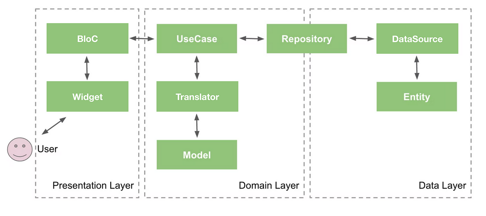
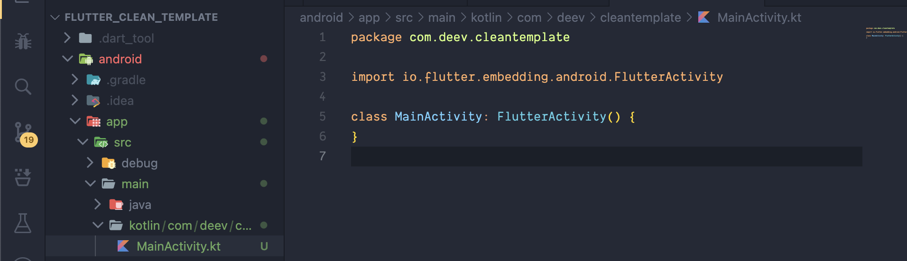

<h1 align="center" >
 Flutter Clean Architecture Template
</h1>
<p align="center">
    <a href="https://github.com/badges/shields/graphs/contributors" alt="Contributors">
        </a>
    <a href="#backers" alt="Backers on Open Collective">
        </a>
    <a href="#sponsors" alt="Sponsors on Open Collective">
        </a>
    <a href="https://github.com/badges/shields/pulse" alt="Activity">
        </a>
    <a href="https://circleci.com/gh/badges/shields/tree/master">
        </a>
    <a href="https://circleci.com/gh/badges/daily-tests">
        </a>
    <a href="https://coveralls.io/github/badges/shields">
        </a>
</p>

<center>
 
```
Developed by @DeevSaini
```
</center>
Basic Skeleton For the Clean Architecture, i use it for all my Production Applications.

## 👇🏻 Getting Started

Just Clone The Repo and Make sure to Change the Bundle Id and App Name according to your need.

### Change the Package Name:

> #### 🤖 For Android:

Open the android/app/build.gradle file.

Locate the applicationId field in the defaultConfig block.

Change the value of applicationId to your desired package name.

> if the app doesnt run make sure you change the package id in main activity also.


<br>
<br>

> #### 📱 For iOS:

Open the ios/Runner.xcworkspace project in Xcode.

In the project navigator, select the Runner target.
In the "General" tab, locate the "Bundle Identifier" field.

Change the value of the "Bundle Identifier" to your desired package name.

## 📇 Change the Display Name:

> #### 🤖 For Android:

Open the android/app/src/main/AndroidManifest.xml file.

Locate the <application> element.

Inside the <application> element, you should find a <meta-data> element with the name "flutterEmbedding" and a value of "2". Right below that, you can add a <meta-data> element to set the display name.

Here's an example of how to set the display name:

```
<meta-data
    android:name="io.flutter.app.display_name"
    android:value="Deev Clean Template" />
```

> #### 📱 For iOS:

Open the ios/Runner/Info.plist file.

Locate the CFBundleName key.

Change the value of CFBundleName to your desired display name.

## 🧹 Clean and Rebuild:

After making these changes, it's a good idea to clean and rebuild your app for both Android and iOS to ensure the changes take effect.

## 🧪 Testing:

Finally, thoroughly test your app on both Android and iOS to make sure everything is working as expected with the new package name and display name.

<h3 align="center">✨ Star the Repo if you Like it ✨</h3>
